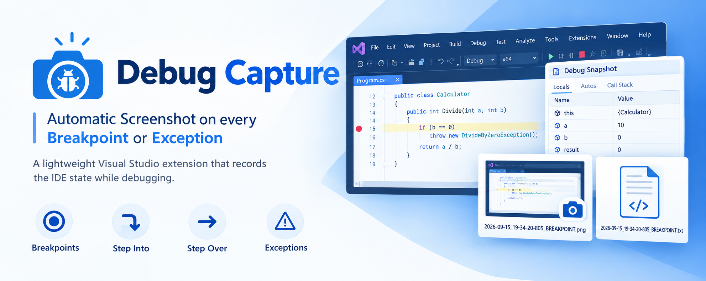
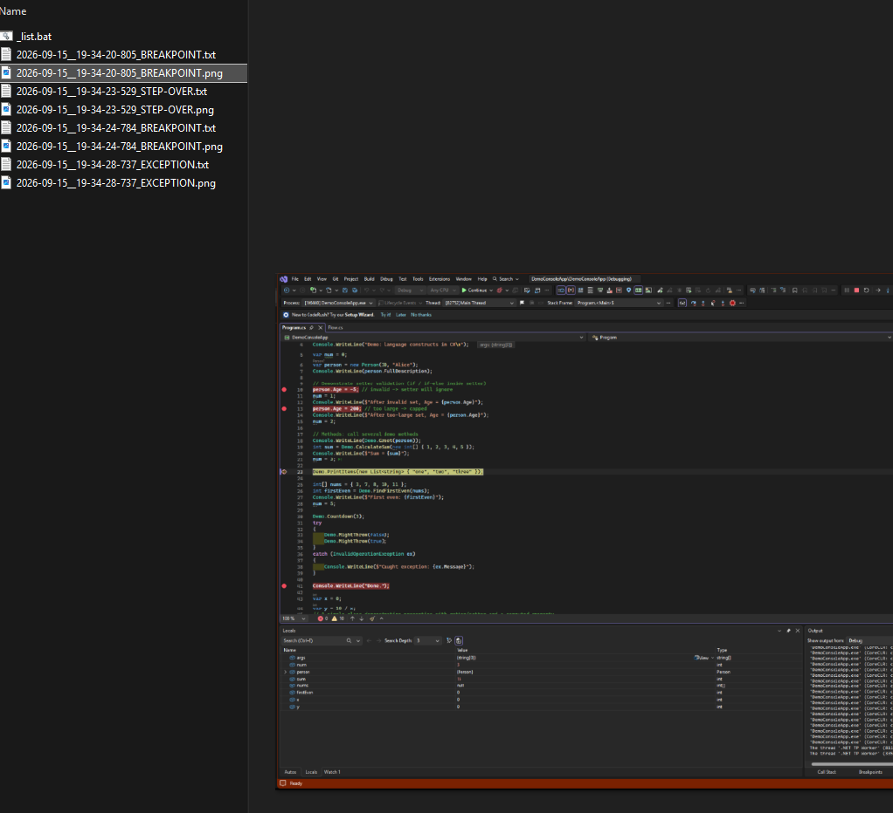
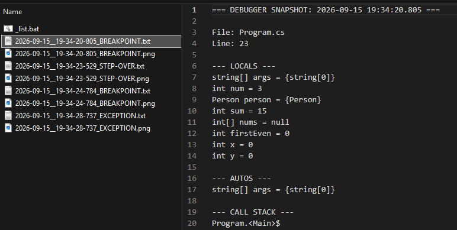
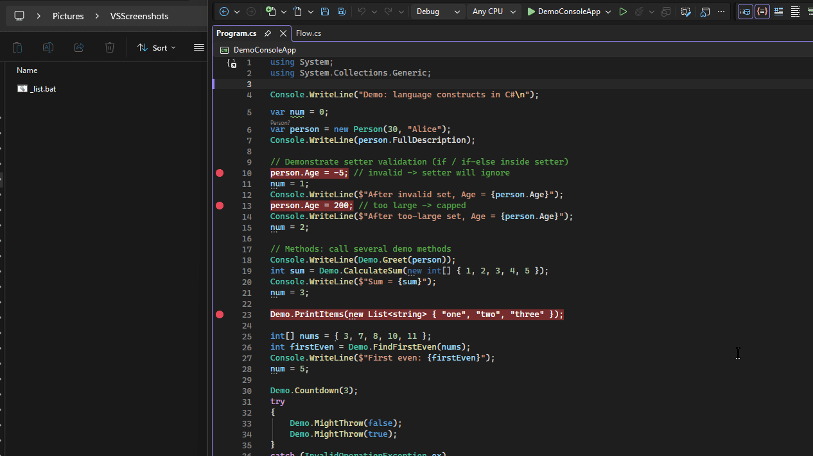

# Debug Capture

> Automatic Screenshot on every **Breakpoint** or **Exception**



Debug Capture is a lightweight Visual Studio extension that records the IDE state while debugging.

It automatically captures a screenshot of the Visual Studio window when debugging stops at important moments.

The extension is designed for Visual Studio 2022+ and targets the 64-bit VSSDK.

## What it captures

- Breakpoints
- Step Into actions
- Step Over actions
- Exceptions when the exception helper window is shown

## Screenshots

> Automatic take screenshots when every breakpoint or exception is hit.



> Automatic Dump Locals and Autos when every breakpoint or exception is hit, to a JSON file.


> Automatic Dump Unhandled Exception details to a JSON file.

# Video demo


## Output files

Each capture creates two matching files in the same directory.

The `.png` file is the Visual Studio screenshot.

The `.json` file is the debugger context captured for that same moment, in a structured, pretty-printed format.

Files are saved to:

`%USERPROFILE%\Pictures\VSScreenshots`

Filename format:

`yyyy-MM-dd_HH-mm-ss-fff_ACTION.ext`

Examples:

- `2026-09-15_19-34-20-805_BREAKPOINT.png`
- `2026-09-15_19-34-20-805_BREAKPOINT.json`
- `2026-09-15_19-34-23-529_STEP-OVER.png`
- `2026-09-15_19-34-23-529_STEP-OVER.json`
- `2026-09-15_19-34-28-737_EXCEPTION.png`
- `2026-09-15_19-34-28-737_EXCEPTION.json`

The timestamp and action suffix are shared, so the related screenshot and debugger JSON file are easy to pair.

## JSON snapshot contents

The `.json` file includes debugger context for the same moment as the screenshot, following the model documented in [Models/Snapshot.md](Models/Snapshot.md).

It contains:

- Current file path and file name, relative to the project when possible
- Current line number and line text
- Locals window values
- Autos/argument values
- Exception details, when triggered by an exception
- Call stack entries
- Session info (project, solution, process, thread)

Variable reads are fault tolerant. If Visual Studio cannot evaluate a value, an `<error: ...>` placeholder is written into the JSON file instead of interrupting debugging.

## Preview JSON files with FZF

Explanation: this helper script lists the generated `.json` snapshot files and opens an interactive FZF picker. The preview pane shows the selected debugger snapshot, making it quick to inspect Locals, Autos, file/line, and call stack data without opening each file manually.

Create `_list.bat` in the screenshot folder:

```
powershell -NoProfile -c ls -Name *.json | fzf --layout=reverse --preview-window=wrap --preview="type {}"
```

Run `_list.bat` to browse debugger JSON snapshots with a preview pane.

## SEARCH TAGS:
- Time Travel Debugging
- Debugging